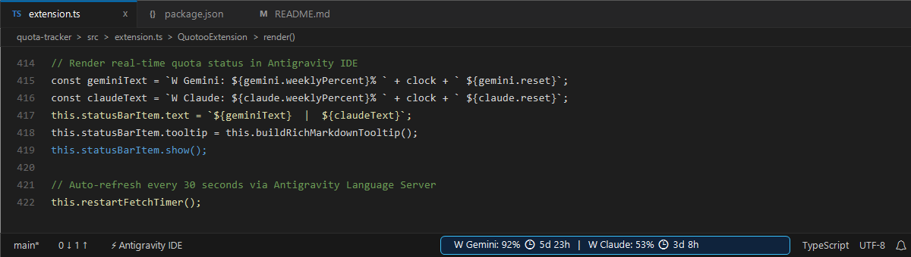
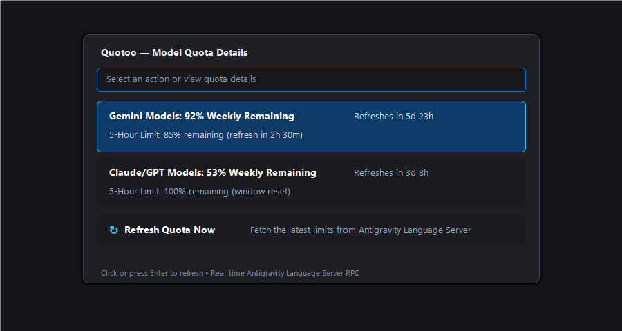
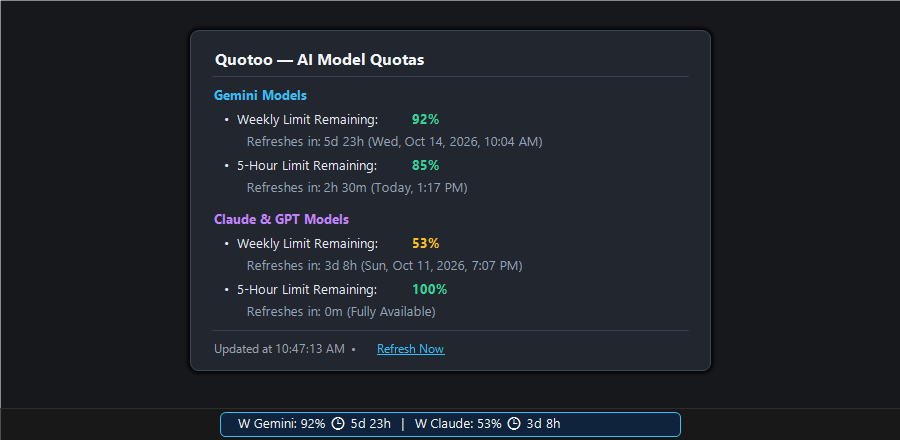

<p align="center">
  
</p>

<h1 align="center">Quotoo</h1>

<p align="center">
  <strong>Real-time AI Model Quota & Reset Countdown Tracker for Antigravity IDE</strong>
</p>

<p align="center">
  <a href="#features"></a>
  <a href="#installation"></a>
  <a href="LICENSE"></a>
  
</p>

<p align="center">
  
</p>

---

**Quotoo** is a lightweight, real-time status bar extension for **Google Antigravity IDE** that tracks your AI model quotas and reset countdown timers directly in your editor workspace.

Never run out of quota in the middle of complex refactoring sessions again — Quotoo keeps you informed of your weekly and 5-hour limit windows for Gemini and Claude models with zero configuration required.

---

## Features

### 📊 Live Status Bar Overview
Monitor remaining model quotas and live countdowns directly in your status bar:
```text
W Gemini: 92% 🕐 5d 23h  |  W Claude: 53% 🕐 3d 8h
```

### 🔍 Interactive Details Modal
Click the status bar item anytime to open the interactive QuickPick modal with detailed breakdowns for each model tier and a 1-click manual refresh action:

<p align="center">
  
</p>

### 💡 Rich Markdown Hover Tooltip
Hover over the status bar badge to inspect exact reset dates, countdowns, and quick actions in a formatted floating card:

<p align="center">
  
</p>

### ⚡ Automated Local Sync
Quotoo connects directly to the Antigravity Language Server via local Connect RPC — zero manual token counting, no API keys, and no external network queries required.

### ⏱️ Dynamic Background Refresh
Automatically queries for updated quota data in the background and keeps countdown timers updated smoothly while you work.

---

## Requirements

> [!NOTE]
> **Quotoo** connects locally to **Google Antigravity IDE** (or VS Code running on a machine where Antigravity IDE / its Language Server is active). If the server is not detected or offline, the status bar displays `$(warning) Quotoo: Offline`.

Compatible with **Windows**, **macOS**, and **Linux**.

---

## Configuration

Open **Settings** (`Ctrl+,` or `Cmd+,`) and search for `quoto`:

| Setting | Default | Description |
|---|---|---|
| `quoto.refreshIntervalSeconds` | `30` | Interval (in seconds) to automatically query the language server for updated quota data (minimum: 10s). |

---

## Commands

Open the Command Palette (`Ctrl+Shift+P` / `Cmd+Shift+P`) and search for:

| Command | Identifier | Description |
|---|---|---|
| **Quotoo: Show Quota Details** | `quoto.showDetails` | Displays interactive modal breakdown of Gemini and Claude limits and reset times. |
| **Quotoo: Refresh Quota Now** | `quoto.refresh` | Forces an immediate refresh from the Antigravity Language Server. |

---

## Installation

### Install from VSIX
1. Download or package the `.vsix` extension:
   ```bash
   npm install
   npm run compile
   npm run package
   ```
2. In Antigravity IDE or VS Code: Press `Ctrl+Shift+P` → type **Extensions: Install from VSIX...** → select `Quotoo-1.0.1.vsix`.

### Development Mode
1. Open the `quota-tracker` folder in Antigravity IDE or VS Code.
2. Press `F5` to launch an Extension Development Host window with Quotoo running live.

---

## Roadmap

- [x] Antigravity IDE local quota tracking (Gemini & Claude weekly / 5-hour limits)
- [ ] Customizable low-quota warning alerts (e.g. status bar color change when quota drops below 20%)
- [ ] Support for additional AI coding agents and CLI assistant quotas
- [ ] System notification toast alerts when quotas reset

---

## License

[MIT](LICENSE)
